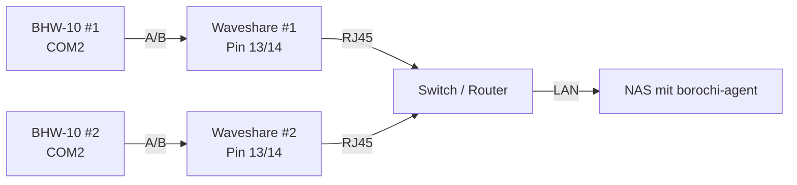

# Verkabelung BHW-10

Wir verbinden die Waveshare-RS485-Klemmen mit dem **COM2-Port** des Solinteg
BHW-10. Das ist der Port, der für externe Modbus-Anbindungen vorgesehen ist
(COM1 nutzt Solinteg intern für sein Eigenmonitoring).

## Pin-Belegung Waveshare

Auf der Waveshare-Box sind die Klemmen oben, beschriftet von links nach rechts:

| Pin | Funktion | Wir nutzen |
|---|---|---|
| 1-12 | Diverses | nein |
| **13** | **RS485 A (data+)** | **ja** |
| **14** | **RS485 B (data−)** | **ja** |
| 15 | GND | nicht zwingend, optional |

<!-- TODO: Foto von Waveshare-Klemmen mit Pin 13/14 markiert -->

## Pin-Belegung BHW-10 COM2

!!! note "Vor dem Aufschrauben"
    Der COM2-Port am BHW-10 ist meistens **unten am Wechselrichter** unter
    einer Plastik-Abdeckung. Stromfrei muss er nicht sein, weil COM-Ports
    potentialfrei sind — aber falls du dir unsicher bist: **WR über LSS am
    Sicherungskasten abschalten**.

| Pin (BHW-10 COM2) | Funktion | Verbinde mit |
|---|---|---|
| Pin 1 | RS485-A | **Waveshare Pin 13 (A)** |
| Pin 2 | RS485-B | **Waveshare Pin 14 (B)** |
| Pin 3 | GND (optional) | Waveshare Pin 15 (falls verwendet) |

<!-- TODO: Foto COM2-Port am BHW-10, geöffnet, Pin-Belegung beschriftet -->
<!-- TODO: Foto Kabel an COM2 angeschlossen, geklemmt -->

!!! warning "A/B-Polarität"
    Solinteg ist konsistent bei A/B. Wenn du dich vertauschst, antwortet
    der Wechselrichter einfach gar nicht — kein Schaden, aber keine Daten.
    Wenn der Modbus-Test (nächstes Kapitel) leer bleibt: A und B tauschen.

## Verkabelungs-Sequenz

## Schritte

1. WR-Abdeckung COM2 abschrauben (meistens 4 Kreuzschrauben).
2. Adern abisolieren, ca. 5mm.
3. Pin 1 (A) am WR mit **einer** Ader verbinden — z.B. die mit blau-weißem Ring.
4. Pin 2 (B) am WR mit der zweiten Ader.
5. Kabel durch die Zugentlastung führen, Abdeckung wieder anschrauben.
6. Andere Seite an Waveshare: Pin 13 (A) und Pin 14 (B).
7. Wiederholen für WR2 mit zweiter Waveshare.

<!-- TODO: Foto fertig verkabelte Stelle (beide WRs + beide Waveshares) -->

## Modbus-Adressen setzen

Beide BHW-10 kommen ab Werk mit **Slave-ID `1`**. Da jede Waveshare separat
adressiert wird (über die IP), bleibt das so — du sprichst **Waveshare-1 IP
.180 mit Slave-ID 1** und **Waveshare-2 IP .181 mit Slave-ID 1**.

Falls du beide WRs auf eine Waveshare gemultiplext hättest (was wir hier
**nicht** tun), müsste WR2 auf Slave-ID `2` umgestellt werden.

!!! tip "Slave-ID am BHW-10 prüfen"
    Am Display des Wechselrichters: Settings → Communication → Modbus →
    Slave Address. Sollte `1` sein. Falls anders, dort einstellen.

→ **Weiter: [Modbus-TCP-Test](04-modbus-test.md)** — der Moment der Wahrheit
