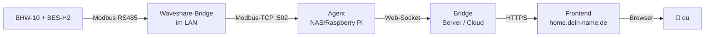

# 2. Software

Borochi besteht aus **drei Komponenten**, die du der Reihe nach installierst:

| Komponente | Wo läuft sie? | Was macht sie? |
|---|---|---|
| **Bridge** (FastAPI) | Eigener Server oder Borochi-Cloud | Auth, User-Management, KI, Tibber, HA-Push, speichert Daten |
| **Agent** (Python) | NAS oder Raspberry Pi, **im gleichen LAN** wie Waveshare | Pollt Modbus, leitet an Bridge, schreibt Befehle zurück |
| **Frontend** (HTML/JS) | Statisch von der Bridge oder beliebigem Webspace | Das schöne Dashboard, was du im Browser siehst |

!!! info "Warum diese Trennung?"
    Der **Agent** muss ins LAN, weil Modbus-TCP keine Internet-Latenzen mag.
    Die **Bridge** kann im Internet liegen, weil du sie von überall erreichen
    willst (auch wenn du im Urlaub bist). Das **Frontend** ist statisch und
    kann genauso überall liegen.

## Zwei Wege — wähl was zu dir passt

!!! tip "Schnellweg vs Server-Setup"
    **Du willst's einfach:** → **[Pi-Image flashen](00-image-flash.md)**.
    SD-Karte beschreiben, Strom dran, fertig. Bridge, Agent, Frontend kommen
    fertig konfiguriert auf einem Raspberry Pi. 5 Minuten Setup.

    **Du willst Kontrolle:** → unten weiterscrollen. Hetzner-VPS oder
    eigene NAS, manuelles Docker-Setup, eigene Domain, alles unter
    deiner Kontrolle. ~30 Min Setup.

### Schnellweg: Pi-Image

- [Pi-Image flashen](00-image-flash.md) — alles vorinstalliert, nur SD-Karte beschreiben

### Manuell: Server-Setup

1. [Bridge-Server bereitstellen](01-bridge-server.md) — Hetzner-VPS oder eigene Hardware
2. [Bridge installieren](02-bridge-docker.md) — Docker-Setup
3. [Agent auf NAS](03-agent-nas.md) — der LAN-seitige Modbus-Poller
4. [Nginx + HTTPS](04-nginx-config.md) — Reverse-Proxy für deine Domain
5. [First-Run-Wizard](05-first-run-wizard.md) — beim ersten Öffnen Admin anlegen

## Alternativ: Borochi-Cloud nutzen

<!-- TODO: Borochi-Cloud-Setup fertig dokumentieren -->

Wenn du dir den eigenen Server-Teil sparen willst, gibt's (geplant) eine
**Borochi-Cloud**: du legst nur den Agent auf deiner NAS an, alles andere
kommt von uns. Pricing: kleine monatliche Pauschale, kein Vendor-Lock-In —
deine Daten kannst du jederzeit exportieren.

→ Details im Kapitel [3. Konfiguration → Borochi-Cloud-Alternative](../03-config/01-cloud-alternative.md)

→ **Los geht's mit dem [Bridge-Server](01-bridge-server.md)**
