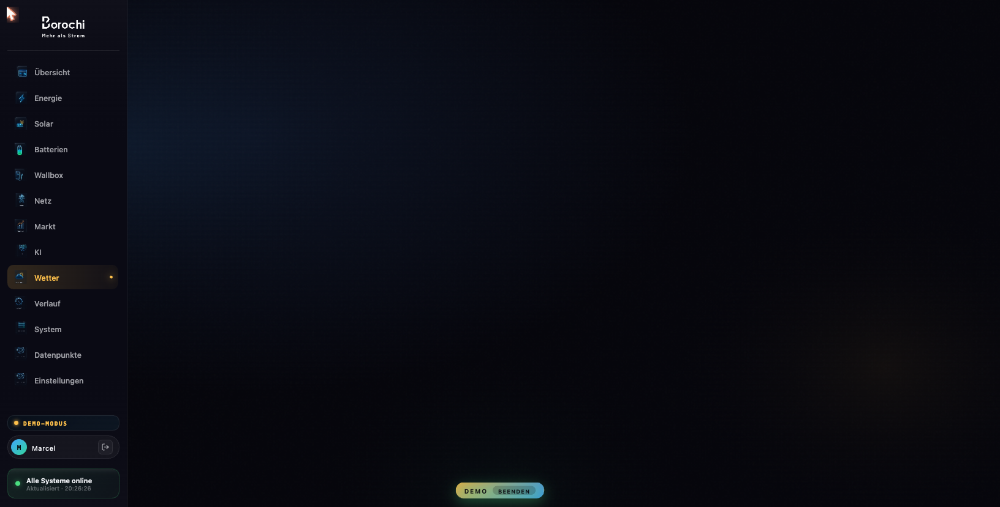

# Wetter (Open-Meteo)

Borochi nutzt **Open-Meteo** für Wetterdaten — gratis, ohne API-Key,
DSGVO-freundlich (europäische Server).

## Was Borochi mit Wetter macht

- **Wetter-Hero** auf der Übersicht zeigt aktuelles Wetter + dein Hausfoto
  passend zum Tageslicht
- **Wetter-Seite** mit 24h-Hourly + 7-Tage-Forecast, Wind-Kompass,
  Sonnen-Bahn, Niederschlag-Wahrscheinlichkeit
- **PV-Prognose** — kombiniert Cloud-Cover + Tageslänge mit deiner kWp-Größe
- **Wetterpartikel** (Regen / Schnee / Wind) als Animation im Hero
- **Sturm-Warnung** wenn Wind > 80 km/h oder Hagel angesagt → Notification

## Konfiguration

### Schritt 1: Standort

Settings → Allgemein → **Standort:**

| Feld | Beispiel |
|---|---|
| Postleitzahl + Ort | `50667 Köln` |
| oder: Latitude / Longitude | `50.94 / 6.96` |
| Höhe ü. NN (optional) | `53m` |

Borochi findet die Koordinaten automatisch beim Eingeben der PLZ.

<!-- TODO: Screenshot Standort-Einstellung -->

### Schritt 2: Aktivieren

Settings → Integrationen → **Open-Meteo** → Schalter `aktiv`.

Das war's. Open-Meteo wird **alle 10 Minuten** gepollt, das Frontend zieht
die letzten Werte aus der Bridge-DB.

### Schritt 3: Dein Hausfoto

Auf der Wetter-Seite (und im Hero auf der Übersicht) wird **dein eigenes
Hausfoto** als Hintergrund eingeblendet, mit Tageslicht-Filter (Tag / Twilight
/ Nacht).

So legst du es an:

1. Mache ein **gutes Foto** deines Hauses bei Tageslicht von der Sonnenseite.
   - Querformat, ~1920×1080 oder größer.
   - Möglichst ohne Menschen/Autos.
2. Speichere als `house.jpg` oder `house.webp`.
3. Settings → Anlagen → **Hausfoto hochladen** → Datei wählen.

Borochi rendert daraus 4 Tageszeit-Varianten automatisch:
- 🌅 Sunrise (warmtone)
- ☀️ Day (neutral)
- 🌇 Sunset (orange-tint)
- 🌙 Night (cool-blue + dimmed)

{ width=1200 }

## PV-Prognose anpassen

Settings → PV-Prognose:

| Parameter | Was |
|---|---|
| Ausrichtung | `Süd 180°`, `West 270°`, ... (für jeden String separat) |
| Neigung | meist 30–45° |
| Verschattung | `keine`, `morgens leicht`, `nachmittags Baum`, ... |
| String-Verteilung | Welche kWp gehen auf welchen MPPT-Eingang |

Diese Daten werden mit den Open-Meteo-Cloud-Forecasts kombiniert, um
die **PV-Prognose-Kurve** auf der Solar-Page zu berechnen.

<!-- TODO: Screenshot PV-Prognose-Settings -->

## Datenquellen-Detail

| Quelle | URL | Daten | Update |
|---|---|---|---|
| Open-Meteo Current | `api.open-meteo.com/v1/forecast` | Temp, Wind, Cloud, UV | alle 10 Min |
| Open-Meteo Hourly | dieselbe | 96h vorausschauend | 1× pro Stunde |
| Sonnenstand | berechnet | Azimuth / Elevation | live im Browser |

Keine personenbezogenen Daten werden geteilt — Open-Meteo bekommt nur deine
Koordinaten (auf ~1km gerundet).

## Wenn Wetterdaten fehlen

| Symptom | Lösung |
|---|---|
| `— —` im Wetter-Hero | Bridge-Logs prüfen, Open-Meteo-Verfügbarkeit ([status.open-meteo.com](https://status.open-meteo.com)) |
| Hausfoto wird nicht angezeigt | Dateigröße < 5 MB? Format jpg/webp/png? |
| PV-Prognose unsinnig | Ausrichtung + kWp pro String korrekt? |

→ **Weiter: [KI anbinden](03-ki-anbinden.md)**
