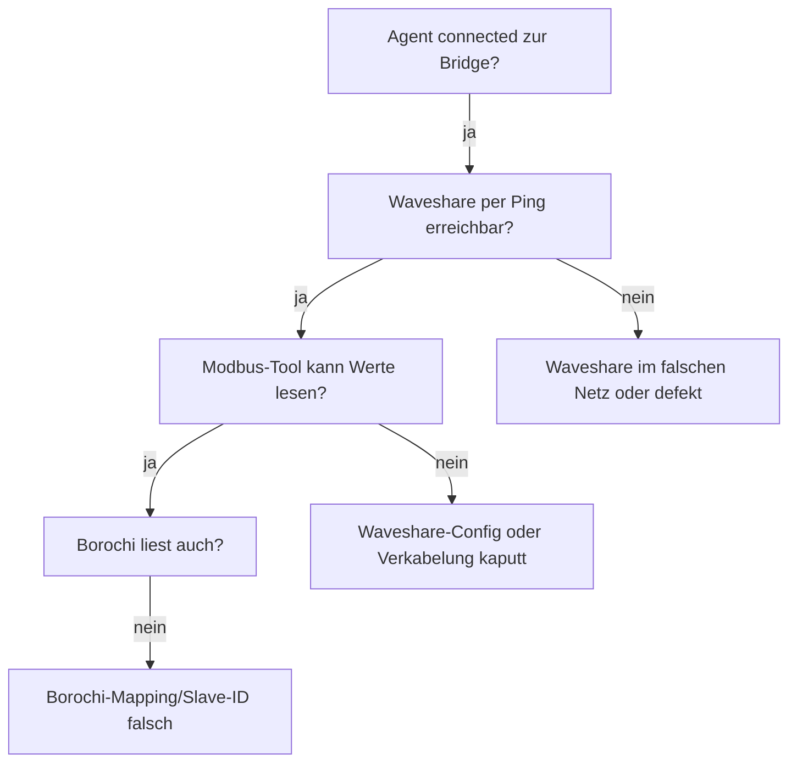

# Modbus antwortet nicht

Agent ist online, aber alle Werte bleiben `0`, `null` oder die Live-Pille
sagt 🟡 statt 🟢. Das ist meistens ein **Hardware- oder Verkabelungs-Problem**.

## Erst mal sauber diagnostizieren



## Symptom 1: Waveshare nicht pingbar

```bash
ping 192.168.178.180   # WR1-Waveshare
ping 192.168.178.181   # WR2-Waveshare (falls vorhanden)
```

Beide tot? → Hardware-Problem.

- **Power LED an?** Wenn nein → Stromversorgung (5V/2A?) checken
- **Link LED am LAN-Port an?** Wenn nein → Patchkabel tauschen
- **Falsche IP?** Mit VirCom-Tool oder Router-UI nach Waveshare im DHCP-Pool suchen — vielleicht hat sie DHCP-IP statt static

## Symptom 2: Pingbar, aber kein TCP auf Port 502

```bash
nc -vz 192.168.178.180 502
# Wenn das hängt oder "Connection refused": Modbus-Modus aus
```

→ Im Waveshare Web-UI (`http://192.168.178.180`):
- Socket-Tab → **TCP Server**, Port **502**, **Modbus_TCP_to_RTU** aktiviert?
- Save + Reboot

## Symptom 3: TCP geht, modpoll bekommt aber nichts

```bash
modpoll -m tcp -a 1 -r 11000 -c 1 -t 4 192.168.178.180
# "Polling slave... Reply time-out!"
```

→ Das heißt: TCP zur Waveshare klappt, aber **RS485 zum BHW-10 funktioniert nicht**.

### Verkabelung prüfen

1. **A und B tauschen.** 50%-Treffer. RS485 ist polaritäts-sensitiv und Solinteg ist die einzige Quelle der Wahrheit darüber, was A und B ist.
2. **COM2 oder COM1?** Manche WR haben mehrere COM-Ports. COM2 ist meistens für externe Modbus, COM1 internal.
3. **Klemme richtig fest?** Adern können bei zu dünner Klemmung aus den Klemmen rutschen
4. **Multimeter:** Zwischen A und B ohne aktiven Verkehr: ~5V Differenz (idle). Wenn 0V → kurz; wenn 12V+ → falsche Pins.

### Solinteg-Display checken

Am WR:
1. Menü → Communication → **Modbus**
2. **RS485 enabled?** (sollte ON sein)
3. **Slave Address?** (default 1)
4. **Baud?** (default 9600)

Falls einer dieser Werte verstellt ist, hier setzen.

### COM-Port falsch?

Schau ins Solinteg-Manual: bei manchen BHW-10 Firmware-Varianten ist COM1
extern und COM2 internal. Probiere die andere Stelle.

## Symptom 4: modpoll geht, Borochi liest aber `0`

→ Borochi und modpoll reden mit derselben Waveshare. Wenn modpoll Daten kriegt und Borochi nicht, ist's **Software**:

- **Slave-ID** im Agent korrekt? `BOROCHI_AGENT_*` env-Variable oder Settings → Agents → Konfiguration. Default `1`.
- **Register-Mapping** falsch? Wenn deine Solinteg-Firmware abweicht, brauchst du den [Modbus-Sniffer](../04-bedienung/03-modbus-sniffer.md) zum Reverse-Engineering
- **Polling pausiert** weil zu viele Fehler? Settings → Agents → "Logs" — wenn da "Backoff aktiv" steht: Agent-Container neu starten

## Symptom 5: Einige Werte ja, andere nein

Z.B. PV geht, Batterie nicht:

- Standard-Register sind PV `11000+`, Battery `33000+`, Grid `13000+`. Wenn nur ein Bereich `0` zeigt, hat deine Solinteg-Variante andere Register dafür
- **Sniffer-Page** öffnen, Range scannen, neue Adressen identifizieren
- "Als bekannt eintragen" speichert die korrigierten Adressen in der Bridge

## Symptom 6: Timing-Probleme — alle paar Minuten Aussetzer

- **Polling-Frequenz zu hoch?** Bei 1-Sek-Polling kann's bei 2 WR + 50 Registern eng werden — auf 5-Sek hochsetzen
- **Schlechtes Kabel?** Schirmung von CAT5e hilft gegen EM-Störungen — falls dein Kabel an Stromleitungen vorbeiläuft
- **Terminator-Widerstand?** Bei längeren Strecken (>10m) braucht's am Ende einen 120Ω-Widerstand zwischen A und B

## Letzte-Hoffnung-Diagnose

```bash
# Modbus-Sniffer ganzes Spektrum scannen, alle 1000er-Blöcke
modpoll -m tcp -a 1 -r 0     -c 50 -t 4 192.168.178.180
modpoll -m tcp -a 1 -r 1000  -c 50 -t 4 192.168.178.180
modpoll -m tcp -a 1 -r 5000  -c 50 -t 4 192.168.178.180
modpoll -m tcp -a 1 -r 10000 -c 50 -t 4 192.168.178.180
modpoll -m tcp -a 1 -r 11000 -c 50 -t 4 192.168.178.180
modpoll -m tcp -a 1 -r 30000 -c 50 -t 4 192.168.178.180

# Wenn irgendwo nicht "Reply time-out" sondern echte Werte → da steckt was
```

Mit `-t 3` (Holding) statt `-t 4` (Input) wiederholen falls leer.

→ Wenn das nicht hilft: [GitHub Issue](https://github.com/digihonk/Home-Bridge/issues) mit Hardware-Setup-Beschreibung und Sniffer-Output aufmachen.
