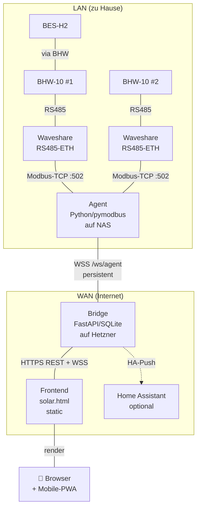

# Architektur

Wenn du Borochi forken, anpassen oder zu Pull-Requests beitragen willst,
hier die Übersicht über alle Komponenten.

## Drei-Repo-Architektur



## Repo-Struktur

| Repo | Sprache | Zweck |
|---|---|---|
| `digihonk/Home` | HTML/CSS/JS | Frontend (`solar.html`), 233 PNG-Icons, Sprites |
| `digihonk/Home-Bridge` | Python (FastAPI) | Auth, User-Mgmt, KI, HA-Push, Tibber, Modbus-Cache |
| `digihonk/Home-Agent` | Python (pymodbus) | Modbus-Polling, Connection zur Bridge |

## Bridge

```
bridge-repo/src/borochi_bridge/
├── app.py              # FastAPI Routes (REST + WS)
├── auth.py             # JWT, TOTP, Cookies
├── storage.py          # SQLite-Schema + Migrationen
├── ha_push.py          # Home-Assistant-Push, Token-Encryption
├── modbus_proxy.py     # Agent ↔ Bridge WS-Protokoll
├── ai_provider.py      # OpenAI / Anthropic / Gemini Wrapper
├── tibber.py           # Tibber-GraphQL-Client
├── settings.py         # Env + Defaults
└── __main__.py         # Entrypoint
```

### DB-Schema (SQLite)

| Tabelle | Zweck |
|---|---|
| `users` | Username, Password-Hash, TOTP-Secret, Recovery-Code, Role |
| `sessions` | Cookie-Tokens, Expiry, User-Agent |
| `agents` | Token-Hash, Name, Last-Seen, Revoked |
| `agent_pairings` | Pairing-Codes mit TTL |
| `pending_commands` | Bridge → Agent Command Queue |
| `meta` | Encrypted Settings (HA-Token, KI-Keys, Tibber-Token) |
| `modbus_scans` | Sniffer-Results |
| `register_map` | Bekannte Modbus-Register pro Anlage |
| `events` | Audit-Log |

### Migrations

Bei Bridge-Start läuft `_migrate_*`-Funktionen, die idempotent Schema-Updates
machen. Du kannst neue Migrations einfach hintenanhängen — beim nächsten Boot
laufen sie einmal.

## Agent

```
agent-repo/src/borochi_agent/
├── __main__.py         # Entrypoint + Action-Loop
├── poller.py           # Modbus-Read/Write, scan_range, _interpretations
├── bridge_client.py    # WSS-Connection, Reconnect-Logik
├── modbus_map.py       # Bekannte Register + Skalierung
└── settings.py
```

### Action-Protokoll

Agent ↔ Bridge sprechen JSON-Frames über die WSS-Connection.

Agent → Bridge:

```json
{
  "type": "metrics",
  "ts": "2026-05-17T18:23:11Z",
  "wr1": { "pv1": 1247, "pv2": 890, ... },
  "wr2": { "pv1": 1102, ... },
  "bat": { "soc": 78.2, "power": -1200 }
}
```

Bridge → Agent (Commands):

```json
{
  "type": "modbus_scan",
  "command_id": "abc123",
  "host": "192.168.178.180",
  "slave": 1,
  "start": 11000,
  "count": 50,
  "fc": 4
}
```

Agent → Bridge (Command-Result):

```json
{
  "type": "command_result",
  "command_id": "abc123",
  "ok": true,
  "data": { "0": 1247, "1": 0, ... }
}
```

## Frontend

`solar.html` — eine **einzige Datei** mit:
- 12 Pages (Übersicht, Energie, Solar, Batterien, Wallbox, Netz, Markt, KI, Wetter, Verlauf, System, Datenpunkte) als JS-View-Module
- CSS direkt im `<style>`-Block
- JS direkt im `<script>`-Block
- Externe Assets nur Icons + Sprites in `assets/`

### State-Management

Globales `state`-Objekt mit Sub-Slices (`state.pv`, `state.battery`, ...).
WS-Updates patchen das `state` und rufen entsprechende `render*`-Funktionen.

### Demo-Mode

`localStorage.b_demo === '0'` schaltet Demo aus. Default ist Demo an.
`demoMode === true` füllt alle `state.*`-Werte mit `genFakeMetric()`.

### Build / Deploy

Kein Build-Step. Direkt deploybar. `git pull` auf dem Server holt's
fertig.

→ Weiter: [API-Reference](02-api-reference.md)
